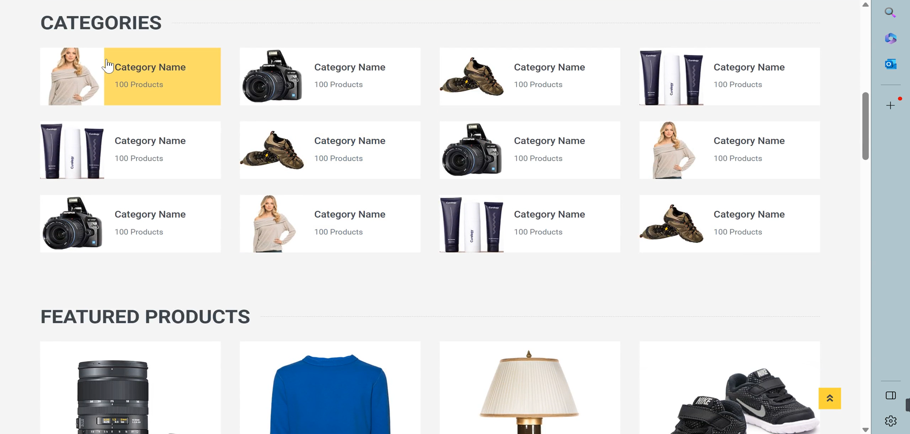
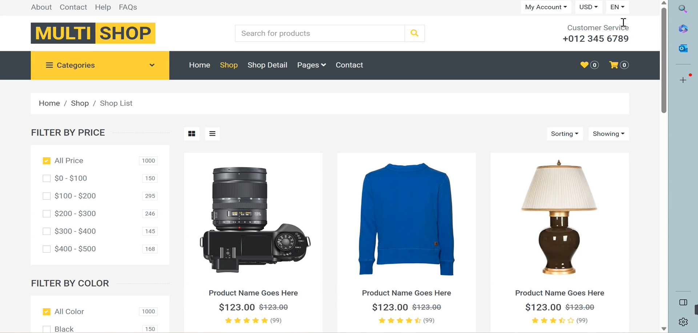
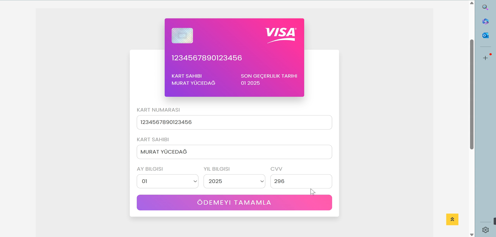
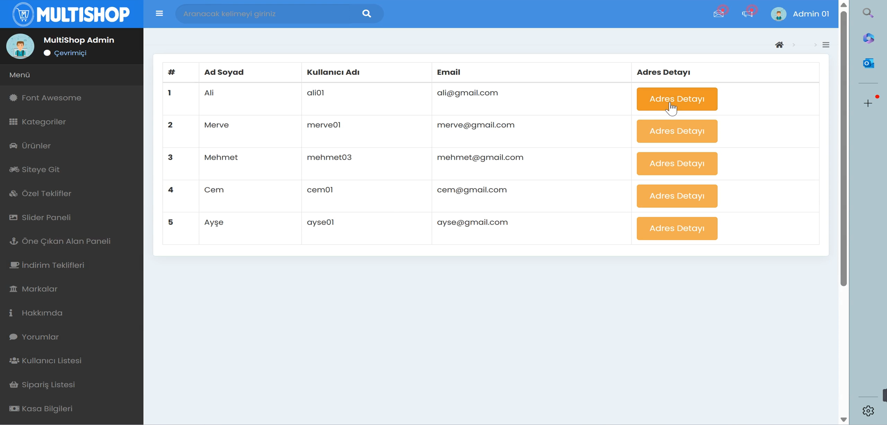

# 🛍️ MultiShop E-Commerce Microservices — Modern E-Commerce Application

<br>

[](../../issues/new?labels=bug)
[](../../issues/new?labels=enhancement)

<br>

## 📌 Project Overview

MultiShop is a **full-featured e-commerce platform** built with a modern **microservices architecture**.  
It supports **guest users**, **authenticated users**, and **admins**, each with dedicated authorization flows.  
Users can browse products, filter by category, view details, add items to their cart, and manage their shopping experience through a dynamic interface.  
The project was developed by following **Murat Yücedağ’s 56-hour Udemy microservices course**, with a focus on **clean code** and **SOLID principles**.  
In several parts of the project, **the original architecture was modified and improved** to enhance structure and maintainability.  
All databases are containerized using Docker, and content can be managed entirely through the admin panel without direct code changes.

<br>

## ✨ Features

- 🧭 **Guest, User, and Admin roles** with separate authorization mechanisms  
- 🛒 Product browsing, category filtering, detailed product pages, and cart operations  
- 🧱 **Fully dynamic pages** managed from the admin panel without code edits  
- 🧹 Clean architecture applying **SOLID principles** throughout  
- 🐳 **Dockerized databases** and service orchestration  
- 📡 **Microservices communication** through API Gateway and Ocelot  
- 🔐 **Authentication and Authorization** with Identity Server and JWT  
- 🧠 **Onion Architecture**, **CQRS**, **Mediator**, and **Repository** patterns  
- ⚡ **Dapper** for efficient data access and **AutoMapper** for object mapping  
- 📜 **Swagger** for API documentation and testing  

<br>

## 🖼️ Screenshots
Shown below in order:  
**1. Landing** · **2. Categories & Products** · **3. Shop**<br>
**4. Payment** · **5. Dashboard** 

<p align="center">
  
  
  
</p>

<p align="center">
  
  
  
</p>

<br>

## 🧰 Tech Stack

<p>
  
  
  
  
  
  <br>
  
  
  
  
</p>

<br>

## 📥 Installation

### Prerequisites
- Docker & Docker Compose  
- .NET 6+ SDK  
- PostgreSQL, MSSQL, MongoDB images available locally or pulled via Docker

### Setup
```bash
git clone [repository-url]
cd multishop-ecommerce-microservices

# Build and run all services using Docker
docker-compose up -d --build

```

<br>

## 📜 License

[](LICENSE)

This project is licensed under the terms described in the [LICENSE](./LICENSE) file.

---

© 2025 Yusuf Okan Sirkeci — [Hereetria](https://github.com/Hereetria)
